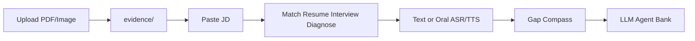

<div align="center">

# Compass

### Evidence-Driven Job Compass
### 证据驱动求职罗盘

<br/>

[](VERSION)
[](packages/compass-core/tests)
[](apps/interview-live)
[](LICENSE)

<br/>

**Upload · Match · Patch · Interview · Diagnose**

<br/>

| 中文 | English | 日本語 | Español |
|:----:|:-------:|:------:|:------:|
| 把真实经历变成可投递、可面试的**证据系统** | Turn real experience into **matchable, interview-ready evidence** | 実体験を応募・面接に耐える**証拠**へ | Convierte tu experiencia en **evidencia entrevistable** |

<br/>

`Compass Web (WebSocket)` · `Cursor Skill` · `CLI` · `MCP` · Local-First

<br/>

[快速开始](#快速开始--quick-start) ·
[Studio](#compass-studio) ·
[能力](#核心能力) ·
[命令](#slash--cli) ·
[迭代](docs/ITERATION.md) ·
[合规](docs/COMPLIANCE.md)

</div>

---

## 快速开始 / Quick Start

```bash
# Windows
.\scripts\install.ps1
pip install -e "packages/compass-core[dev,studio,live,rag]"
pip install -r apps/studio/requirements.txt
pip install -r apps/interview-live/requirements.txt

# Docker（推荐 · WebSocket 主界面）
docker compose up --build
# → http://127.0.0.1:8766/  宽屏 Web 工作台
# 可选 Gradio：docker compose --profile gradio up

# 本地（主界面）
python -m compass_core.cli web --root content --port 8766
python -m compass_core.cli export-report --root content
# 可选旧版 Gradio
python -m compass_core.cli studio --root content --port 7860
```

HF Space：[README_SPACE.md](README_SPACE.md)（仅 fixtures）· 传播文：[docs/launch_article_zh.md](docs/launch_article_zh.md) · [Good First Issues](docs/GOOD_FIRST_ISSUES.md)

Unix: `./install.sh` then the same `crawl-llm` / `studio` commands.

---

## Compass Web（主界面）

宽屏 WebSocket 工作台（`apps/interview-live`）：

| 区 | 做什么 |
|:---|:-------|
| 上传简历 | PDF / 图片 / 文本 → 证据草稿 |
| 求职流水线 | JD → 匹配 · 主题简历 · 面试包 · 诊断 · 图谱 |
| 实时面试 | WebSocket 追问 + Web Speech + Monaco |
| 题库 | Token / 语义 RAG |
| 证据图谱 | `/timeline` |

```bash
python -m compass_core.cli web --root content --port 8766
```

Gradio Studio 仍可用（可选）：`compass studio`。

---

## 核心能力

| 能力 | 说明 |
|:-----|:-----|
| **缺口罗盘** | 证据 / 叙事 / 技能 / 流程 + 做什么 / 证明物 / 耗时 |
| **证据门禁** | 无 `evidence_id` 不写作成绩；可标 `UNVERIFIED` |
| **12 主题模板** | JSON Resume 兼容 HTML/MD，[来源备注](packages/compass-core/compass_core/assets/templates/SOURCES.md) |
| **LLM/Agent 题库** | 精选 + 公开源爬取，[来源备注](packages/compass-core/compass_core/assets/questions/SOURCES.md) |
| **合规发现** | 粘贴 / RSS / career 页；默认不做平台自动投递 |

闭环：`上传简历 → 岗位 → patch → 面试(文本/语音) → 诊断 → bridge`



---

## Slash / CLI

| Skill | CLI | 作用 |
|:------|:----|:-----|
| `/intake` | `intake` | 画像 |
| `/evidence` | `evidence-index` | 证据索引 |
| `/discover` | `discover` | 岗位导入 |
| `/resume` | `resume-patch` | 主题 patch |
| `/interview` | `interview-pack` | 面试包 |
| `/diagnose` | `diagnose` | 缺口罗盘 |
| `/desk` | `desk` | 轻量看板 |
| — | `studio` | **Gradio 主界面** |
| — | `crawl-llm` | 刷新 LLM/Agent 题 |

完整 Skill：[skill/SKILL.md](skill/SKILL.md)

---

## 仓库结构

```
apps/studio/       # Gradio 交互（主 UI）
apps/desk/         # 轻量 HTTP 看板
packages/          # compass-core · compass-mcp
skill/             # Cursor Skill
collectors/        # 合规采集 + 快照
content/           # 本地产物
docs/              # 合规 · 竞品 · 迭代计划
```

---

## 合规 / Compliance

- 题库爬取仅限**公开 raw/文档**；拒绝登录招聘站深度抓取。
- 简历文件仅存本地 `content/`，默认不上云。
- 详见 [docs/COMPLIANCE.md](docs/COMPLIANCE.md)。

---

## License

MIT — [LICENSE](LICENSE)
