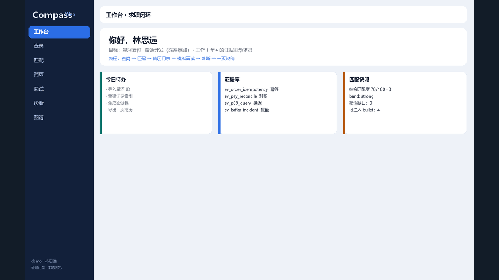
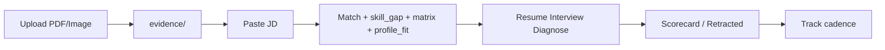

<div align="center">

# Compass

### Evidence-Driven Job Compass
### 证据驱动求职罗盘

<br/>

[](VERSION)
[](packages/compass-core/tests)
[](apps/interview-live)
[](LICENSE)
[](https://github.com/QinHsiu/Compass/stargazers)
[](https://github.com/QinHsiu/Compass/issues)

<br/>

**Upload · Match · Patch · Interview · Diagnose · Track**

<br/>

| 中文 | English | 日本語 | Español |
|:----:|:-------:|:------:|:------:|
| 把真实经历变成可投递、可面试的**证据系统** | Turn real experience into **matchable, interview-ready evidence** | 実体験を応募・面接に耐える**証拠**へ | Convierte tu experiencia en **evidencia entrevistable** |

<br/>

`Compass Web (WebSocket)` · `Cursor Skill` · `CLI` · `MCP` · Local-First

<br/>

[快速开始](#快速开始--quick-start) ·
[演示](#演示--demo-video) ·
[能力](#核心能力) ·
[命令](#slash--cli) ·
[宣传成片](docs/promo/README.md) ·
[竞品学习](docs/COMPETITIVE.md) ·
[迭代](docs/ITERATION.md) ·
[合规](docs/COMPLIANCE.md)

</div>

---

## 演示 / Demo Video

以虚构人物「林思远」（1 年 Java 后端）走完：查岗 → 匹配 → 简历分析/修改 → 模拟面试 → 诊断建议 → **可投递一页简历**（约 1 分 30 秒，含中文旁白）。

GitHub README **不能**直接播放仓库内相对路径的 MP4，因此这里用可内嵌的动图预览；完整有声成片请用下方链接下载或用 `<video>` CDN 地址打开。

<div align="center">



<video src="https://media.githubusercontent.com/media/QinHsiu/Compass/master/docs/promo/out/compass-backend-demo.mp4" controls width="900" poster="docs/promo/shots/01-home.png">
</video>

</div>

- **有声 MP4（推荐）**：[下载 / 浏览器打开](https://media.githubusercontent.com/media/QinHsiu/Compass/master/docs/promo/out/compass-backend-demo.mp4)
- 仓库路径：[`docs/promo/out/compass-backend-demo.mp4`](docs/promo/out/compass-backend-demo.mp4)（请用系统播放器打开，勿依赖 GitHub 文件页预览）
- 本地播放页：[docs/promo/out/play.html](docs/promo/out/play.html) · [可投递一页简历](docs/promo/out/resume_onepager_lin.html)
- [口播与分镜](docs/promo/COMPASS_DEMO_PLAYBOOK.md) · [宣传物料](docs/promo/README.md)

---

## 快速开始 / Quick Start

**硬件建议（Docker）**：≥ **4GB RAM**、2 CPU。轻量本地可不装 `[rag]`。  
环境变量模板：[`.env.example`](.env.example)（密钥**可选**；无 Key 仍可跑 Demo）。

```bash
# 1) 分层安装（推荐）
pip install -e "packages/compass-core"                 # 核心 CLI
pip install -e "packages/compass-core[live]"           # Web 主界面
pip install -r requirements-web.txt                    # 钉版本范围
# 可选：
# pip install -e "packages/compass-core[rag]"          # Chroma 语义检索
# pip install -e "packages/compass-core[asr]"          # faster-whisper
# pip install -e "packages/compass-core[pdf,dev,studio]"

# 2) Docker（推荐试用）
cp .env.example .env   # 按需填写
docker compose up --build
# → http://127.0.0.1:8766/
# 可选 Gradio：docker compose --profile gradio up

# 3) 本地 Web
python -m compass_core.cli web --root content --port 8766
```

演示截图见 [docs/assets/demo-pipeline.svg](docs/assets/demo-pipeline.svg)。  
HF Space：[README_SPACE.md](README_SPACE.md) · 传播文：[docs/launch_article_zh.md](docs/launch_article_zh.md) · [Good First Issues](docs/GOOD_FIRST_ISSUES.md) · [Star the repo](https://github.com/QinHsiu/Compass)

依赖复现：见 [`requirements-lock.txt`](requirements-lock.txt)（如何 regenerate 见文件头注释）。

---

## Compass Web（主界面）

宽屏 WebSocket 工作台（`apps/interview-live`）：

| 区 | 做什么 |
|:---|:-------|
| **职业探索** | 经历/文件 → 置信度分流 → 直接规划或 Holland RIASEC 测评 → 六维可视化与交互报告 → 一键进求职准备 |
| 上传简历 | PDF / 图片 / 文本 → 证据草稿 |
| 求职准备 | JD → 匹配 · 主题简历 · 面试包 · 诊断 · 图谱 |
| 实时面试 | WebSocket 追问 + 证据门禁 + scorecard 落盘 + Web Speech / Monaco |
| 题库 | Token / 语义 RAG |
| 证据图谱 | `/timeline` |

```bash
python -m compass_core.cli web --root content --port 8766
```

Gradio Studio 仍可用（可选）：`compass studio`。

---

## 核心能力

| 能力 | 说明 |
|:-----|:-----|
| **证据门禁** | 无 `evidence_id` 不写作成绩；可标 `UNVERIFIED` |
| **技能缺口预检** | JD → `existing` / `supported_by_evidence` / `gap`；简历禁止注入 gap |
| **需求证据矩阵** | 每条 JD 行 `direct` / `partial` / `gap` + 建议档（strong→skip） |
| **画像约束** | `profile_fit`：地点 / 目标岗 / avoid → 可强制 skip |
| **面试记分卡** | 五维 rubric 持久化 `scorecard.json`，同步 `session.md` |
| **勿声称清单** | `retracted_claims`：硬缺口 / 门禁失败 → 面试风险点 |
| **投递节奏** | match band → `follow_up_due` / `suggested_action`；`track --list-due` |
| **缺口罗盘** | 证据 / 叙事 / 技能 / 流程 + 做什么 / 证明物 / 耗时 |
| **12 主题模板** | JSON Resume 兼容 HTML/MD，[来源备注](packages/compass-core/compass_core/assets/templates/SOURCES.md) |
| **LLM/Agent 题库** | 精选 + 公开源爬取，[来源备注](packages/compass-core/compass_core/assets/questions/SOURCES.md) |
| **合规发现** | 粘贴 / RSS / career 页；默认不做平台自动投递 |

闭环：`上传 → 匹配(explain) → patch → 面试(scorecard) → 诊断 → track`



竞品对照与本轮学习笔记：[docs/COMPETITIVE.md](docs/COMPETITIVE.md) · 变更记录：[CHANGELOG.md](CHANGELOG.md)

---

## Slash / CLI

| Skill | CLI | 作用 |
|:------|:----|:-----|
| `/life` | `life explore\|answer\|refine\|export` | 兴趣探索 → 职业规划（RIASEC） |
| `/intake` | `intake` | 画像 |
| `/evidence` | `evidence-index` / `gate` | 证据索引 · 声明门禁 |
| `/discover` | `discover` · `scout` · `watch scan` · `batch --jobs` · `skill-gap` · `grade` · `jd-analyze` | ATS/feeds/**multi**/巡检 · 评分 · JD红旗 |
| `/resume` | `resume-patch` · `resume-metrics` · `resume-import` | 主题 patch（可 `--job-ids --workers`）· 密度/指标 · PDF 导入 |
| `/interview` | `interview-pack` · `scorecard` · `questions --company` · `storybank` · `transcript-import` | 面试包 · 根因 · 大厂题包 · 故事库 · 转录五维 |
| `/diagnose` | `diagnose` · `export-report --mentor` · `research` · `calibrate` · `tutorial` · `report-summary` | 缺口罗盘 · 引导 · 练习汇总 |
| `/track` | `track` · `offer` · `negotiate` · `obs` | 投递 · Offer · 谈判 · 本地可观测 |
| `/desk` | `desk` | 轻量看板 |
| — | `web` / `live` | **Web 主界面** |
| — | `studio` | Gradio（可选） |
| — | `crawl-llm` | 刷新 LLM/Agent 题 |

完整 Skill：[skill/SKILL.md](skill/SKILL.md)

```bash
# 典型最短路径
python -m compass_core.cli discover --root content --source paste --text-file jd.txt
python -m compass_core.cli match-explain --root content --job-id <id>
python -m compass_core.cli resume-patch --root content --job-id <id>
python -m compass_core.cli interview-pack --root content --job-id <id>
python -m compass_core.cli diagnose --root content --job-id <id>
python -m compass_core.cli track --root content --list-due
```

---

## 仓库结构

```
apps/interview-live/   # Web 主界面（WebSocket）
apps/studio/           # Gradio（可选）
apps/desk/             # 轻量 HTTP 看板
packages/              # compass-core · compass-mcp
skill/                 # Cursor Skill
collectors/            # 合规采集 + 快照
content/               # 本地产物（默认 gitignore PII）
docs/                  # 合规 · 竞品 · 迭代计划
```

---

## 合规 / Compliance

- 题库与岗位默认仅限**公开**源；登录态采集需 `--i-accept-tos-risk`（见 COMPLIANCE）。
- 十万岗对标为**本地** Job Warehouse + MCP `jobs_search`，非托管竞品库。
- 实时薪资：`comp lookup --live`（OfferShow / Levels / HTTP / JD / 官网爬取入库），见 [docs/comp_live.md](docs/comp_live.md)。
- 岗位推荐：`recommend jobs` 从各公司官网 + 公开 ATS 抓取，见 [docs/recommend.md](docs/recommend.md)。
- 多源论证 / 拒虚假：`intel dossier|verify-salary`，见 [docs/intel.md](docs/intel.md)。
- 简历 / 证据 / 画像仅存本地 `content/`，默认不上云、不提交真实经历。
- 详见 [docs/COMPLIANCE.md](docs/COMPLIANCE.md) · [docs/observability.md](docs/observability.md)。

---

## License

MIT — [LICENSE](LICENSE)
